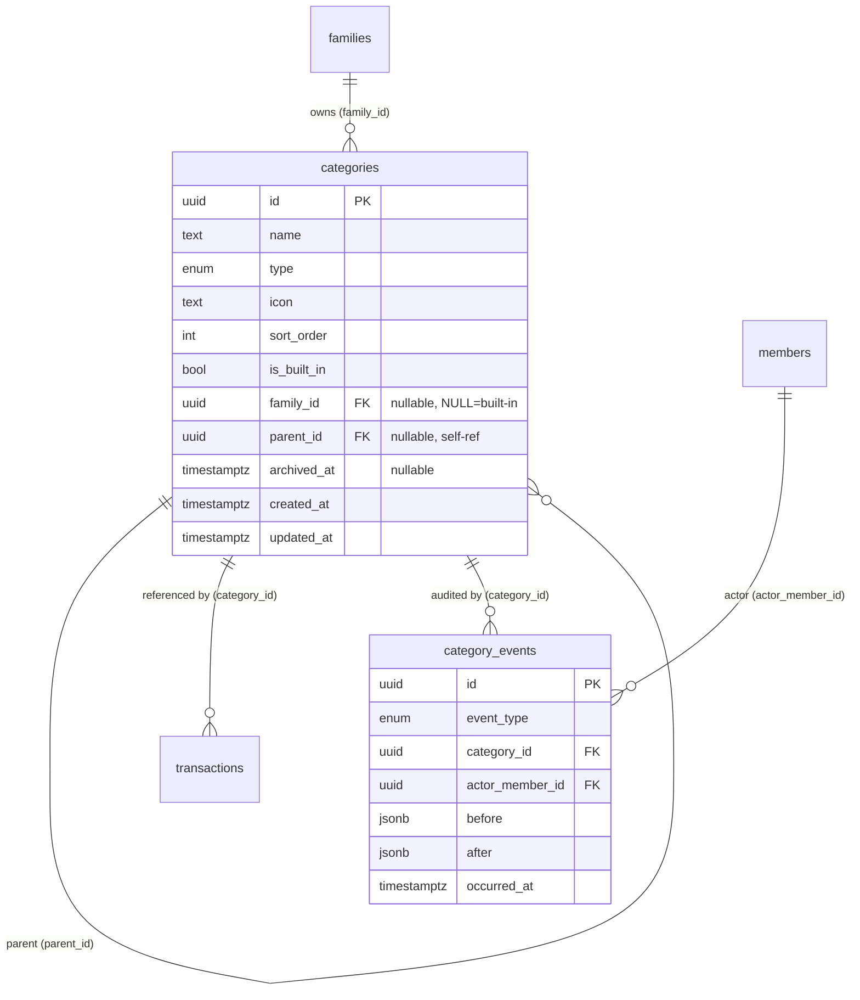

# Data Model: 自定义分类 (018-custom-category)

**Date**: 2026-07-09 | **Spec**: [spec.md](./spec.md) | **Research**: [research.md](./research.md)

> Phase 1 产物: schema 设计、索引、约束、迁移 SQL、实体关系。

## 实体一览

| 实体 | 类型 | 来源 | 说明 |
|---|---|---|---|
| `categories` | 扩展表 | 003 + 018 | 加 4 字段 (family_id/parent_id/archived_at/updated_at) + 2 索引 |
| `category_events` | 新建表 | 018 | 审计日志 (沿用 transaction_events 模式) |
| `families` | 既有 | 001 | 自定义分类的聚合根 |
| `members` | 既有 | 001 | actor_member_id 引用 |
| `transactions` | 既有 | 004 | 通过 categoryId 引用 categories (无改动) |

## `categories` 表 (扩展)

### 完整 schema (Drizzle)

```ts
// src/server/db/schema/category.ts (扩展 003)
import {
  pgTable, uuid, text, integer, boolean, timestamp, pgEnum, uniqueIndex, index,
} from "drizzle-orm/pg-core";
import { sql } from "drizzle-orm";
import { family } from "./family";

export const categoryType = pgEnum("category_type", ["income", "expense"]);

export const category = pgTable(
  "categories",
  {
    // ─── 003 既有字段 (不变) ───
    id: uuid("id").primaryKey(),
    name: text("name").notNull(),
    type: categoryType("type").notNull(),
    icon: text("icon").notNull(),
    sortOrder: integer("sort_order").notNull().default(100),
    isBuiltIn: boolean("is_built_in").notNull().default(true),
    createdAt: timestamp("created_at", { withTimezone: true }).notNull().defaultNow(),

    // ─── 018 新增字段 ───
    familyId: uuid("family_id").references(() => family.id, { onDelete: "restrict" }),
    // 内置 = NULL (全局共享), 自定义 = 所属家庭 ID
    parentId: uuid("parent_id"),  // self-reference (FK 见下), 顶级 = NULL
    archivedAt: timestamp("archived_at", { withTimezone: true }),  // NULL = 活跃
    updatedAt: timestamp("updated_at", { withTimezone: true }).notNull().defaultNow(),
  },
  (t) => ({
    // 003 既有索引 (保留): list 查询用 (内置于全表扫描)
    typeSortNameIdx: index("categories_type_sort_name_idx").on(
      t.type, t.sortOrder, t.name,
    ),

    // 018 新增: 层级 list 主索引 (family_id IS NULL OR = $1) + (type?) + (parent_id?)
    // 注意: partial index 不能 OR,所以用全索引 + 应用层 filter
    familyTypeParentSortIdx: index("categories_family_type_parent_sort_idx").on(
      t.familyId, t.type, t.parentId, t.sortOrder, t.createdAt,
    ),

    // 018 新增: 自定义分类 family-scoped 唯一性 (case-insensitive + NULL → sentinel)
    // COALESCE 把 NULL family_id/parent_id 转为 sentinel UUID,保证唯一性约束生效
    // LOWER(name) 实现大小写不敏感
    familyTypeParentNameUniqueIdx: uniqueIndex("categories_family_type_parent_name_unique_idx")
      .on(
        sql`COALESCE(${t.familyId}, '00000000-0000-0000-0000-000000000000'::uuid)`,
        t.type,
        sql`COALESCE(${t.parentId}, '00000000-0000-0000-0000-000000000000'::uuid)`,
        sql`LOWER(${t.name})`,
      ),

    // 018 新增: parentId 自引用 FK (循环防护靠应用层 + 深度 ≤ 2)
    // 注意: Drizzle 内自引用需用 .from() 延迟引用
  }),
);

// 自引用 FK 单独声明 (Drizzle 限制)
// 实际在 migration SQL 里: ALTER TABLE categories ADD CONSTRAINT categories_parent_id_fkey
//   FOREIGN KEY (parent_id) REFERENCES categories(id) ON DELETE RESTRICT;
```

### 字段语义

| 字段 | 类型 | 内置 (isBuiltIn=true) | 自定义 (isBuiltIn=false) |
|---|---|---|---|
| `id` | UUID | v5 确定性 (003 seed) | v7 随机 (运行时) |
| `family_id` | UUID nullable | **NULL** | **NOT NULL** (强制于 procedure 层,DB 层 nullable 因 003 既有) |
| `parent_id` | UUID nullable | NULL | NULL (顶级) 或 父 ID (二级) |
| `archived_at` | timestamp nullable | NULL (不可归档) | NULL (活跃) 或 timestamp (归档) |
| `updated_at` | timestamp | = created_at (不更新) | 每次 update/refresh 触发 |

### 约束矩阵

| 约束 | 实现层 | 说明 |
|---|---|---|
| 内置分类不可写 | App (procedure) | isBuiltIn=true 时拒 create/update/archive |
| 自定义分类 family_id NOT NULL | App (procedure) | DB 层 nullable 因 003 数据;procedure 层强制 |
| 二级深度上限 | App (procedure) | parentId 指向的分类本身 parentId IS NULL |
| 子 type = 父 type | App (procedure) | 校验 child.type === parent.type |
| family + type + parent + name 唯一 | DB (索引) | categories_family_type_parent_name_unique_idx |
| parentId 自引用 | DB (FK + App) | DB FK ON DELETE RESTRICT (防误删父带子);App 校验 parentId ≠ self.id |
| archivedAt 一致性 | App (procedure) | 级联归档/反归档靠事务,无 DB 触发器 |

## `category_events` 表 (新建)

### 完整 schema (Drizzle)

```ts
// src/server/db/schema/category-events.ts
import {
  pgTable, uuid, jsonb, timestamp, pgEnum, index,
} from "drizzle-orm/pg-core";
import { category } from "./category";
import { member } from "./member";
import { uuidv7 } from "uuidv7";

export const categoryEventType = pgEnum("category_event_type", [
  "category_created",
  "category_edited",
  "category_archived",
  "category_unarchived",
]);

export const categoryEvent = pgTable(
  "category_events",
  {
    id: uuid("id").primaryKey().$defaultFn(() => uuidv7()),
    eventType: categoryEventType("event_type").notNull(),
    categoryId: uuid("category_id").references(() => category.id, {
      onDelete: "set null",  // 分类不硬删,实际不触发,与 transaction_events 一致
    }),
    actorMemberId: uuid("actor_member_id").notNull().references(() => member.id, {
      onDelete: "cascade",
    }),
    before: jsonb("before"),  // 编辑前可变字段快照 (create/archive 时为 null)
    after: jsonb("after"),    // 编辑后可变字段快照
    occurredAt: timestamp("occurred_at", { withTimezone: true }).notNull().defaultNow(),
  },
  (t) => ({
    catTimeIdx: index("category_events_cat_time_idx").on(t.categoryId, t.occurredAt),
    familyTimeIdx: index("category_events_family_time_idx")  // 可选: 通过 JOIN 推导 family
      .on(t.actorMemberId, t.occurredAt),
  }),
);

export type CategoryEvent = typeof categoryEvent.$inferSelect;
export type CategoryEventType = (typeof categoryEventType.enumValues)[number];
```

### before/after jsonb 形态

仅记录**可变字段**(name/icon/sortOrder/parentId/type/archivedAt),不含 id/familyId/isBuiltIn/createdAt/updatedAt。

```ts
type CategoryMutationSnapshot = {
  name: string;
  icon: string;
  sortOrder: number;
  parentId: string | null;
  type: "income" | "expense";
  archivedAt: string | null;  // ISO timestamp
};
```

### 事件类型 vs 字段填充

| eventType | before | after |
|---|---|---|
| `category_created` | null | 全字段 (创建后快照) |
| `category_edited` | 编辑前快照 | 编辑后快照 (含未变字段) |
| `category_archived` | archivedAt=null 的快照 | archivedAt=timestamp 的快照 |
| `category_unarchived` | archivedAt=timestamp 的快照 | archivedAt=null 的快照 |

> **级联归档/反归档**: 父 + 每个子各写一条事件 (e.g. 父带 3 子归档 = 4 条 `category_archived` 事件)。actor_member_id 一致,occurred_at 接近 (同一事务内)。

## 迁移 SQL (0006)

```sql
-- 0006_category_v15_extensions.sql
--
-- 018-custom-category: V1.5 schema 扩展
-- 1. ALTER categories 加 4 字段
-- 2. 新增索引 (层级 list + family-scoped 唯一)
-- 3. 新建 category_events 审计表
-- 4. 内置分类回填 (family_id/parent_id/archived_at 设为 NULL, updated_at = created_at)

-- ─── 1. ALTER categories ───
ALTER TABLE "categories"
  ADD COLUMN "family_id" uuid REFERENCES "families"("id") ON DELETE RESTRICT,
  ADD COLUMN "parent_id" uuid,
  ADD COLUMN "archived_at" timestamp with time zone,
  ADD COLUMN "updated_at" timestamp with time zone DEFAULT now() NOT NULL;

-- 自引用 FK (延迟添加,因为表已存在)
ALTER TABLE "categories"
  ADD CONSTRAINT "categories_parent_id_fkey"
  FOREIGN KEY ("parent_id") REFERENCES "categories"("id") ON DELETE RESTRICT;

-- ─── 2. 新增索引 ───

-- 层级 list 主索引
CREATE INDEX "categories_family_type_parent_sort_idx"
  ON "categories" ("family_id", "type", "parent_id", "sort_order", "created_at");

-- family-scoped 唯一性 (case-insensitive, NULL → sentinel)
CREATE UNIQUE INDEX "categories_family_type_parent_name_unique_idx"
  ON "categories" (
    COALESCE("family_id", '00000000-0000-0000-0000-000000000000'::uuid),
    "type",
    COALESCE("parent_id", '00000000-0000-0000-0000-000000000000'::uuid),
    LOWER("name")
  );

-- ─── 3. category_events 审计表 ───
CREATE TYPE "category_event_type" AS ENUM(
  'category_created',
  'category_edited',
  'category_archived',
  'category_unarchived'
);

CREATE TABLE "category_events" (
  "id" uuid PRIMARY KEY NOT NULL,
  "event_type" "category_event_type" NOT NULL,
  "category_id" uuid REFERENCES "categories"("id") ON DELETE SET NULL,
  "actor_member_id" uuid NOT NULL REFERENCES "members"("id") ON DELETE CASCADE,
  "before" jsonb,
  "after" jsonb,
  "occurred_at" timestamp with time zone DEFAULT now() NOT NULL
);

CREATE INDEX "category_events_cat_time_idx"
  ON "category_events" ("category_id", "occurred_at");

-- ─── 4. 003 内置分类回填 (零数据风险) ───
-- family_id/parent_id/archived_at 默认即为 NULL,无需显式回填
-- updated_at 列已设 DEFAULT now() NOT NULL,自动填充,但希望等于 created_at:
UPDATE "categories" SET "updated_at" = "created_at" WHERE "updated_at" IS NULL OR "updated_at" = now();
-- 注: 上面 UPDATE 在迁移中实际可能更新所有行 updated_at = created_at,符合预期

-- ─── 5. 验证 ───
-- 003 现有 22 个内置分类: family_id IS NULL ✓
-- 现有 transactions 引用: 无破坏 (新字段对 JOIN 透明)
```

### Down (回滚) 迁移 (供 plan 参考)

```sql
-- 0006_down.sql (仅供 plan 参考,实际不执行除非紧急回滚)
DROP TABLE IF EXISTS "category_events";
DROP TYPE IF EXISTS "category_event_type";
DROP INDEX IF EXISTS "categories_family_type_parent_name_unique_idx";
DROP INDEX IF EXISTS "categories_family_type_parent_sort_idx";
ALTER TABLE "categories" DROP CONSTRAINT IF EXISTS "categories_parent_id_fkey";
ALTER TABLE "categories"
  DROP COLUMN IF EXISTS "updated_at",
  DROP COLUMN IF EXISTS "archived_at",
  DROP COLUMN IF EXISTS "parent_id",
  DROP COLUMN IF EXISTS "family_id";
```

## 实体关系图 (Mermaid)



## 容量估算

| 维度 | 估值 | 说明 |
|---|---|---|
| 单家庭分类总数 | < 100 (含 22 内置 + 自定义,200 硬上限) | FR assumption |
| 单家庭 category_events 全生命周期 | < 1000 行 | 远低于 transaction_events |
| 全平台 (10K 家庭) categories 行数 | < 1M | 索引选择性良好 |
| 全平台 category_events (5 年) | < 50M | 永久保留,需评估存储 (单行 ~500B,~25GB) |

> **存储风险**: 50M events × 500B ≈ 25GB,可接受。若突破 100K 家庭,V2 评估 partition by family_id 或 rolling delete (research.md D5)。

## 索引性能 (P95 SLA 验证)

| 查询模式 | 用到的索引 | 预期 P95 |
|---|---|---|
| `category.list({ type? })` (合并内置 + 自定义 + 层级) | `categories_family_type_parent_sort_idx` | < 50ms (扫描 ~122 行) |
| `category.get({ id })` | PK | < 5ms |
| `category.create` (含唯一性预检 + advisory lock + INSERT + audit) | unique idx + PK | < 100ms |
| `category.update` (含 type-match 校验 + transactions 引用检查 + UPDATE + audit) | PK + transactions.category_id_idx | < 150ms |
| `category.archive` (含级联 + N × audit) | PK + parent_id index (隐含) | < 100ms (单家庭 < 50 子) |

均满足 FR-027 的 P95 < 200ms / 150ms SLA。
